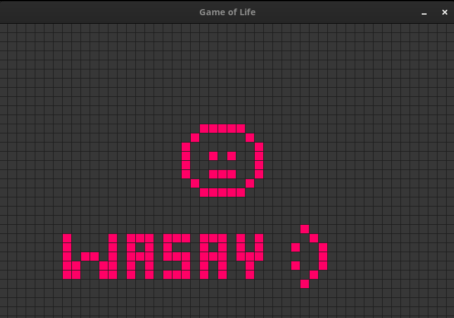

# Game of Life

## Overview
"Life's but a walking shadow, a poor player that struts and frets his hour upon the stage and then is heard no more. It is a tale told by an idiot, full of sound and fury, signifying nothing." 
— William Shakespeare, *Macbeth*



Conway's Game of Life mirrors this quote by representing life as a series of simple rules that can lead to complex and often unpredictable behaviors. This project, developed by Muhammad Wasay, serves as both a fascinating exploration of these patterns and a practical application of Object-Oriented Programming (OOP) principles. The intuitive mouse and keyboard controls make interacting with the simulation an engaging experience.

## Features
- **Interactive Grid System**: Efficiently manages cell states and transitions, allowing for dynamic interaction.
- **Simulation Logic**: Accurately implements the rules of Conway's Game of Life.
- **Graphics**: Utilizes Raylib for rendering the simulation with smooth graphics.
- **User Controls**: Easily control the simulation speed, randomization, and state using keyboard inputs.

## Getting Started

### Prerequisites
- C++ Compiler (g++, clang, etc.)
- Raylib library installed

### Installation
1. Clone the repository:
   ```sh
   git clone https://github.com/yourusername/GameOfLife.git
   cd GameOfLife
   ```
2. Install Raylib (if not already installed):
   ```sh
   # On Debian/Ubuntu
   sudo apt install libraylib-dev
   
   # On MacOS
   brew install raylib
   ```

### Compilation
Compile the project using g++:
```sh
g++ main.cpp grid.cpp simulation.cpp -o GameOfLife -lraylib -lGL -lm -lpthread -ldl -lrt -lX11
```

### Running the Simulation
Run the compiled executable:
```sh
./GameOfLife
```

### Controls:
- **Mouse Click**: Toggle cells on or off.
- **R Key**: Populate the grid with a random state.
- **C Key**: Clear the grid.
- **F Key**: Increase the simulation speed.
- **S Key**: Decrease the simulation speed.
- **Enter Key**: Start the simulation.
- **Space Key**: Pause the simulation.

## Code Structure
- **`main.cpp`**: Entry point of the application. Handles the main loop and user inputs.
- **`grid.hpp` & `grid.cpp`**: Defines the `Grid` class, responsible for managing the cells and their states.
- **`simulation.hpp` & `simulation.cpp`**: Defines the `Simulation` class, which implements the logic of Conway's Game of Life.

## Contributing
1. Fork the repository.
2. Create a feature branch (`git checkout -b feature/AmazingFeature`).
3. Commit your changes (`git commit -m 'Add some AmazingFeature'`).
4. Push to the branch (`git push origin feature/AmazingFeature`).
5. Open a Pull Request.

## Acknowledgements
- Thanks to Raylib for providing an easy-to-use graphics library.
- Inspired by the timeless work of John Conway.

## Contact
For any questions or suggestions, feel free to contact Muhammad Wasay at [wasayrana2@gmail.com].
